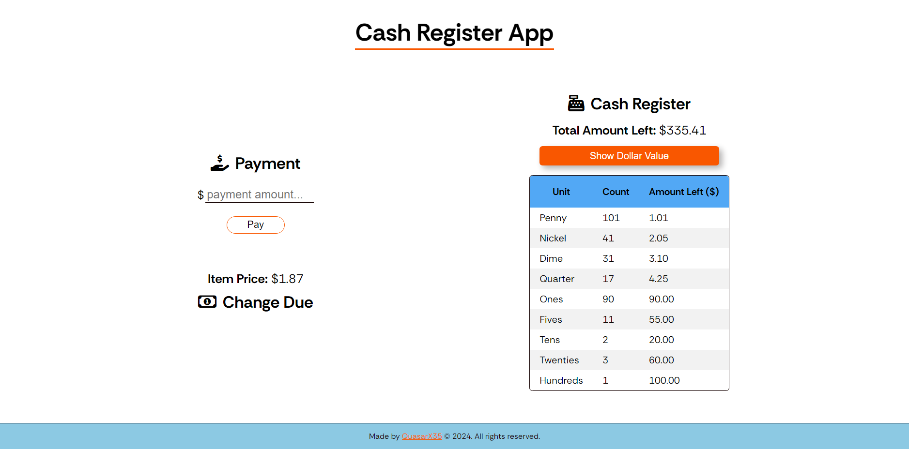
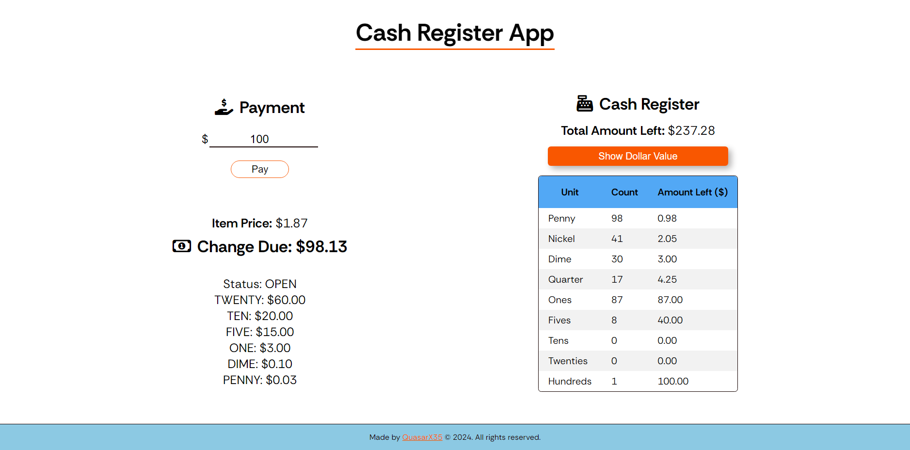
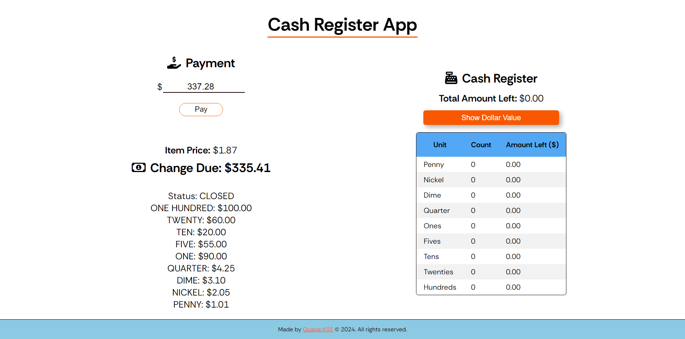
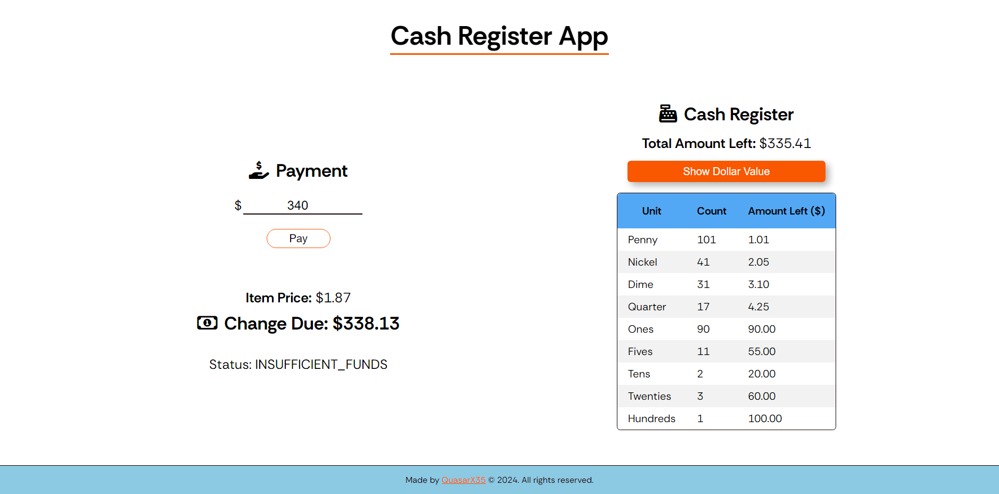
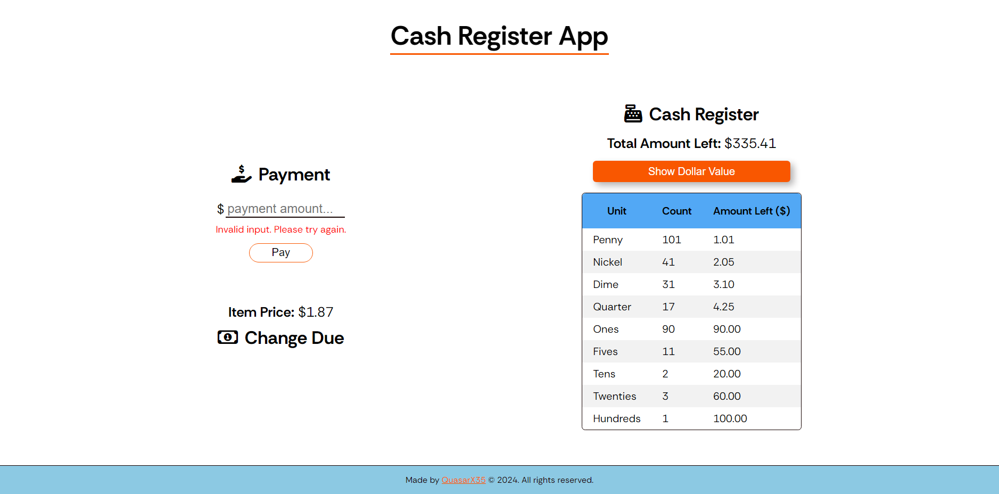
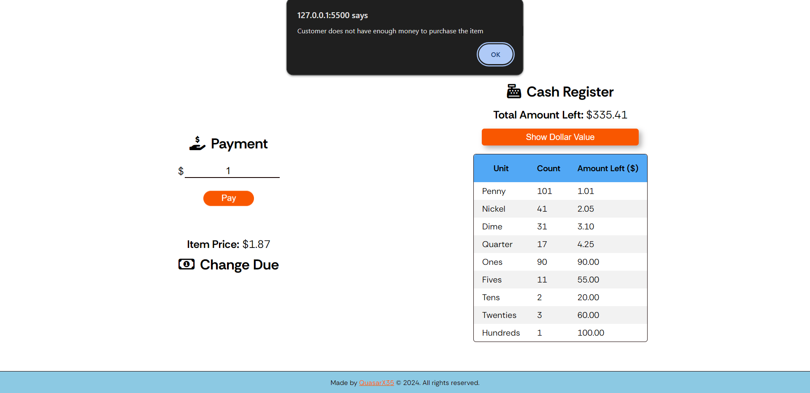

# Cash Register App
This JavaScript application simulates a basic cash register system. It was built as a certification project for the FreeCodeCamp Javascript Algorithms and Data Structures course. The application can be accessed [here](https://kyze-cash-register.netlify.app).

## Using the Application
- Enter the amount of cash tendered by the customer (Check against the price provided).
    - If the cash from the customer is less than the price, an alert will pop up stating that the cash provided is not enough.
- Click the "Pay" button.
- The application will display the appropriate message based on the entered values:
    - Status: OPEN - There is still sufficient change left in the cash register.
    - Status: CLOSED - The change given to the customer is the exact amount of change left in the cash register.
    - Status: INSUFFICIENT_FUNDS - There is not enough total change left in the register or the exact amount of change can't be given to the customer.
- The "Show Dollar Value" button shows how much each unit of currency is worth in US Dollars.

## Functionality
- Calculates the change due to a customer based on the item price, cash tendered, and available cash in the drawer.
- Handles various denominations of US currency (bills and coins).
- Provides informative feedback to the user:
- Insufficient payment message if the cash tendered is less than the item price.
- Exact payment message if the cash tendered matches the item price.
- Change due breakdown for successful purchases, displaying the number of bills and coins of each denomination used.
- Insufficient funds message if the cash drawer does not have enough money to provide change for the correct amount.

## Technologies Used
- HTML: for structuring the user interface.
- CSS: for styling the layout and elements.
- JavaScript: for handling user interaction, calculating change, and displaying results.

## Building the Application
- Clone this repository to your local machine.
- Open the index.html file in your web browser.
- Start editing any of the files.

## Screenshots

View the FreeCodeCamp challenge [here](https://www.freecodecamp.org/learn/javascript-algorithms-and-data-structures-v8/build-a-cash-register-project/build-a-cash-register).